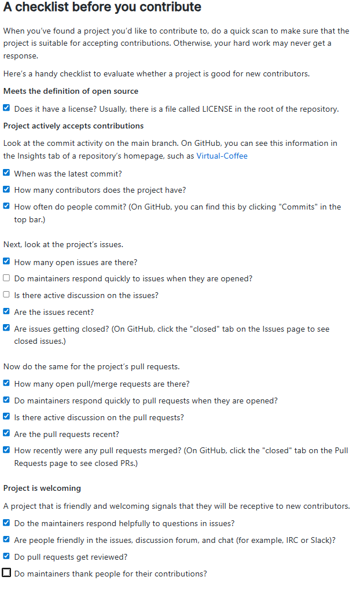
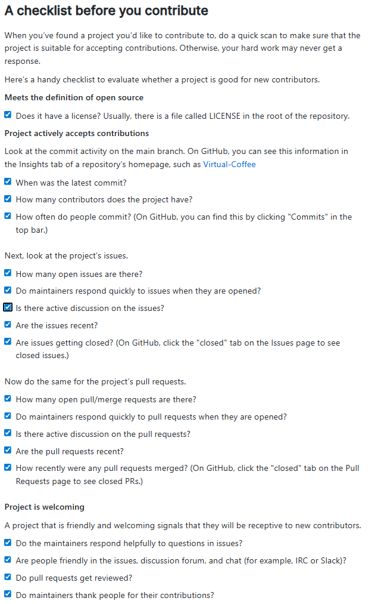

## Design Patterns
### The Abstract Factory Pattern
The Abstract Factory Pattern is a creational design pattern used to create instances of related objects without specifying a concrete class. This is achieved by creating abstract interfaces for the objects which you wish to create and then creating an abstract Factory class to return an object implementing that interface. For example:

```C#
public abstract class ComputerFactory {
    public virtual IComputer CreateComputer();
}

public interface IComputer {
    // . . . computer methods . . . //
}


public class Laptop : IComputer {
    // . . .
}

public class Desktop : IComputer {
    // . . .
}
```

The abstract ComputerFactory class defines the CreateComputer method which returns an object implementing the IComputer interface. Laptop and Desktop both implement this interface. Next, we can concrete factory classes which inherit from the abstract ComputerFactory and which handle the creation of our IComputer variants.

```C#
public class LaptopFactory : ComputerFactory {
    public override IComputer CreateComputer() {
        return new Laptop();
    }
}

public class DesktopFactory : ComputerFactory {
    public override IComputer CreateComputer() {
        return new Desktop();
    }
}
```

Using this pattern, we now have a way of creating and interacting with IComputer objects without having to specify which specific type of computer we are creating. All we have to do is create a variable in our object to cache an subclass of ComputerFactory. We can assign this variable to either an instance of LaptopFactory or DesktopFactory and our code will work just the same.

```C#
public class ManufacturingFacility {
    readonly ComputerFactory _computerFactory;

    public ManufacturingFacility(ComputerFactory factory) {
        _computerFactory = factory;
    }
}
```

Our ManufacturingFacility class can create any type of computer without having to know what type it's creating or which factory it is implementing.

### The Adapter Pattern
The Adapter Pattern is a structural design pattern which allows incompatible objects to interact with one another without making changes to their underlying source code. This is achieved by creating an adapter class which the interface of the incompatible class can interact with. A good example of this is the RecyclerView Adapter in Android studio. The underlying code of the RecyclerView relies upon certain methods contained within the RecyclerView.Adapter class, and by extending this class in a custom Adapter class, the developer can adapt their user-defined classes to interact with the RecyclerView. 

As an example, this CalculatorAdapter class allows a list of  Calculation objects to be displayed in a RecyclerView by defining the ViewHolder and overriding the adapter methods.

```kotlin
class CalculationAdapter(val calculationHistory: List<Calculation>) : RecyclerView.Adapter<CalculationAdapter.ViewHolder>() {
    override fun onCreateViewHolder(parent: ViewGroup, viewType: Int): ViewHolder {
        val view = LayoutInflater.from(parent.context)
            .inflate(R.layout.calculation_item, parent, false)

        return ViewHolder(view)
    }

    override fun onBindViewHolder(holder: ViewHolder, position: Int) {
        holder.textView.text = calculationHistory[position].print(withResult = true)
    }

    override fun getItemCount(): Int {
        return calculationHistory.count()
    }

    class ViewHolder(view: View): RecyclerView.ViewHolder(view) {
        val textView: TextView = view.findViewById(R.id.txt_calculation)
    }
}
```

### The Mediator Pattern
The Mediator Pattern is a behavioural pattern which allows different objects to interact with one another without creating dependencies. Instead of interacting directly, objects only interact with an mediator object which coordinates the interactions. An example of thisis the ViewModel class in android MVVM architecture. The ViewModel is responsible for receiving and delegating information between the View and Model classes, ensuring neither object needs to know about or be dependent upon the other. This not only helps to make the code cleaner, but it also makes it more modular, as the same Model of View functions can be used in different ways dependin upon how data is passed through the mediator.

## Open Source Reflections

### Article: How to Contribute to Open Source
I think the most interesting thing I learned from this article was that not all contributions to open source projects are going to be code based. I had never considered that contributions were also important for things like documentaion, tutorials, etc. I think this helps make contributions feel more accessible, since the idea of contributing to documentation is not quite as intimidating as contributing actual code. This could be a great way of getting used to interacting with open source projects without as much of the pressure, and focusing on documentation contributions is also a great way to familiarize yourself with the project when you feel ready to start contributing code.

I also really appreciated the advice on how to find a project to contribute to. I had always assumed that developers just contributed to projects that they had used in the past or had just stumbled upon, but it's great to see that there are so many resources available to help developers find projects which are actively looking for contributors. Moving forward, I will definitely use this resource, as well as the checklist included in that section, to help me find projects to contribute to.

### Potential Projects to Contribute To

#### MonoGame
[MonoGame](https://github.com/MonoGame/MonoGame) is a game engine developed primarily in C#. The engine was designed to help users create games for PC, consoles, and mobile devices, and has been used to create games like Celeste and Stardew Valley. I think this project could be fun to contribute to since most of my experience as a developer is in game development in C#. 

The project's most recent commit was yesterday (3/8/2026) and activity on the Issues tab seems very regular, with about 600 active issues being discussed and more than 3,000 already closed. The project has 401 contributors and has almost 5,000 closed pull requests.


#### Tandoor Recipes
[Tandoor Recipes](https://github.com/TandoorRecipes/recipes) is a webapp that helps users manage a collection of digital recipes.  The project is built in HTML wih Javascrip, Typescript, Python, ad a few other languages thrown into the mix. As I'm fairly familiar with HTML (and somewhat with Javascript), I think this would be a good project to get some more practice in those languages.

The last commit on the project was a translation which was posted 5 days ago. Issues are added and closed fairly regularly, with the project currently containing 352 open issues and over 2000 closed issues. Tandoor Recipes has 374 contributors. Maintainers don't always respond to issues, and not all issues have active discussion, but they are still actively being worked on and closed.



#### Wikimedia Commons Android App
The [Wikimedia Commons Android App](https://github.com/commons-app/apps-android-commons) is a project which allows users to upload pictures to Wikimedia Commons from their phone. The project is written almost entirely in Kotlin, with a bit of Java thrown in as well. Since I'm currently in the process of learning Kotlin and Android Studio, this could be a very interesting project to dig in to.

The last commit was about 6 hours ago (Mar 9, 2026 at 2:53 PM) and appears to be an update to an array or dataset. There are 650 open issues and almost 3,000 closed issues. Almost every issue has at least one comment from a member of the community. Pull requests, likewise, all have comments and discussions. There are 397 contributors. 

